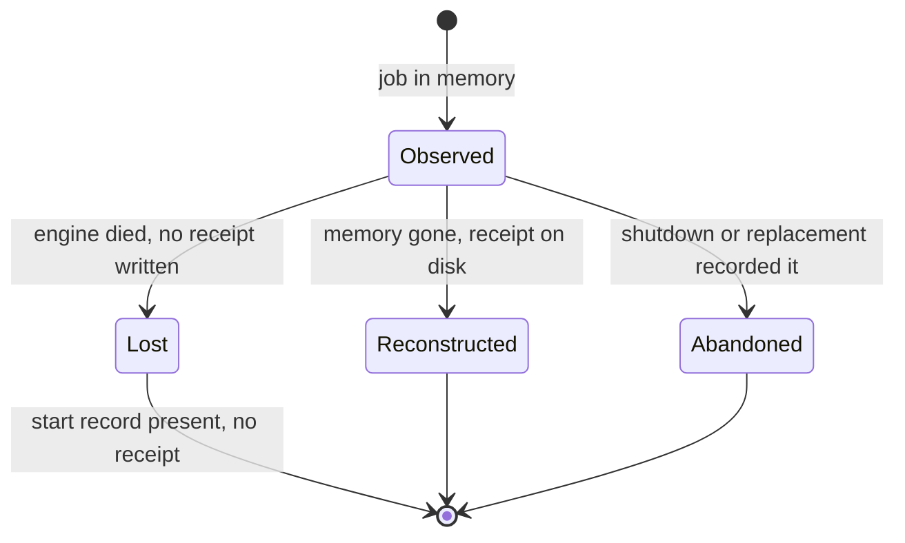

# Phase 1 Data Model: Status Evidence and Trust

## Entities

### Job Outcome Record (`job_receipts`)

Durable record of how a job ended. Exists today (V0007); this feature adds the
evidence a live observer would have had.

| Field | Origin | Change |
|---|---|---|
| `job_id` | V0007 | unchanged (primary key) |
| `bucket_id` | V0007 | unchanged |
| `terminal_state` | V0007 | unchanged. Values stay `exited` / `cancelled` / `failed`. **No `abandoned` value** — see D1. |
| `exit_code` | V0007 | unchanged; nullable |
| `final_signal_counts` | V0007 | unchanged (JSON `{"events_emitted":N}`) |
| `restarted_at` | V0007 | unchanged |
| `created_at` | V0007 | unchanged |
| `metrics_json` | **V0008, new** | JSON evidence blob, nullable |
| `end_cause` | **V0008, new** | nullable text; `abandoned` when the job was ended by engine shutdown or replacement |

**`metrics_json` shape** (all fields bounded numeric or identifier — never frame text):

```json
{
  "frames_total": 4586,
  "frames_stdout": 4586,
  "frames_stderr": 0,
  "bytes_total": 334421,
  "frames_suppressed": 0,
  "frames_suppressed_progress": 0,
  "frames_suppressed_dedupe": 0,
  "duration_ms": 641248,
  "probe_id": "prb_019fd72f..."
}
```

**Why a JSON blob rather than explicit columns**: `final_signal_counts` is the
direct precedent in the same table; the row is only ever read whole by primary
key, and no query filters on metrics. Explicit columns would buy queryability
nothing needs. Endorsed without objection by adversarial review.

**Why no raw tail**: decision D2. Constitution III bars raw frames from
persistent output. `metrics_json` is numeric and identifier evidence only.

**Validation rules**

- Written exactly once per terminal transition, at the moment the outcome becomes
  final.
- `metrics_json` absent ⇒ a pre-migration row. Reported honestly; never
  backfilled or defaulted to zero-as-observed (R7).
- `events_emitted` in `final_signal_counts` MUST equal what a live observer of
  the same run would have seen. Natural exit includes the lifecycle event; the
  operator-stop path does not, because no append occurs (R1).
- `end_cause = abandoned` requires `exit_code IS NULL`. An abandoned job did not
  produce an exit status.

### Job Start Record (`audit_records`)

Already written per lane; previously unused for diagnosis.

| Lane | `action` | `subject` | `decision` |
|---|---|---|---|
| Combed | `command_start` | job id | `allow` |
| PTY | `pty_command_start` | job id | `allow` |
| Watch | `file_watch_start` | job id | `allow` |

**Change**: V0008 adds an index on `(action, subject)`. No new rows are written
by this feature. `AuditReadRequest` gains a subject filter so the lookup can be
expressed at all (R2).

**Validation rules**

- A start record is evidence a job existed, never evidence of its outcome.
- Detection is best-effort: audit emits are swallowed, so a missing row does not
  prove a job never started. Classification therefore degrades toward `unknown`,
  never toward a terminal outcome.

### Trust Indicator (`outcome_trust`)

Closed enum on the status response. Present on **every** response.

| Value | Meaning | Established by |
|---|---|---|
| `observed` | The engine witnessed this outcome live; counters are live observations. | Live in-memory record present |
| `reconstructed` | Outcome read from the durable record after the in-memory record was gone. Evidence is whatever the record retained. | Receipt row present |
| `lost` | The engine durably recorded starting this job and never recorded it finishing. | Start record present, no receipt |
| `abandoned` | The job was ended by engine shutdown or replacement rather than reaching its own conclusion. | Receipt row with `end_cause = abandoned` |

**Validation rules**

- `abandoned` ⇒ lifecycle state is `cancelled` and `exit_code` is null. Never
  `failed` — that would be the false negative this feature exists to remove (D1).
- `lost` ⇒ never accompanied by a successful terminal outcome.
- `observed` ⇒ every counter is a real live observation. This is the invariant the
  cross-lane defect violated.
- No identifier with neither a start record nor a receipt yields a trust value at
  all; it yields an unknown-identifier error.

### Response compatibility surface

| Field | Change |
|---|---|
| `frames_total`, `frames_stdout`, `frames_stderr`, `bytes_total`, `events_emitted` | **Unchanged types.** Remain bare `u64`. Optionality rejected — see R4. |
| `restarted` | Retained, serde-defaulted, original meaning preserved. `true` iff `outcome_trust != observed` — i.e. `reconstructed` or `abandoned`, both read back from the receipt rather than witnessed live. |
| `outcome_trust` | **New**, serde-defaulted to `observed` so older payloads decode unchanged. |

## State and provenance transitions



Unknown is deliberately outside this diagram: it is the absence of any record,
surfaced as an error rather than a trust value.

## Migration

`V0008__outcome_evidence.sql`, additive only:

1. `ALTER TABLE job_receipts ADD COLUMN metrics_json TEXT;`
2. `ALTER TABLE job_receipts ADD COLUMN end_cause TEXT;`
3. `CREATE INDEX IF NOT EXISTS idx_audit_records_action_subject ON audit_records(action, subject);`

No backfill, no data rewrite, no column drop. Existing rows remain valid and are
reported per R7. The index is load-bearing rather than cosmetic because audit
rows are never pruned, so an unindexed subject lookup scans a table that only
grows.
